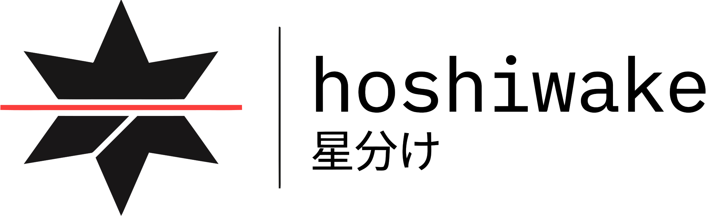

# hoshiwake 星分け




[](https://github.com/adenaufal/hoshiwake/actions/workflows/ci.yml)

A local CLI tool that classifies anime images as SFW, NSFW, or UNCERTAIN and sorts them into folders automatically. Powered by [prithivMLmods/siglip2-x256-explicit-content](https://huggingface.co/prithivMLmods/siglip2-x256-explicit-content) (SiglipForImageClassification). No cloud, no GPU required, and no images leave your machine. The name comes from 星分け, Japanese for "sorting stars".

## Features

- Classifies anime images into SFW / NSFW / UNCERTAIN using a HuggingFace vision model
- Copies or moves files into organized subfolders with configurable confidence thresholds
- Handles JPG, PNG, WEBP, and GIF (first frame) with graceful corrupt-file skipping
- Dry-run mode to preview sorting decisions before touching any files
- Generates a CSV report alongside a console summary
- Runs on CPU by default, with optional CUDA/MPS acceleration

## Quick Start

```bash
# Clone and install
git clone https://github.com/adenaufal/hoshiwake.git
cd hoshiwake
pip install -r requirements.txt

# Sort a folder (dry run first)
python main.py --input ./my-images --output ./sorted --dry-run

# Sort for real (copy mode)
python main.py --input ./my-images --output ./sorted --mode copy
```

## Output Structure

```text
sorted/
|- SFW/
|  |- image_001.png
|  `- image_042.jpg
|- NSFW/
|  |- image_007.png
|  `- image_019.webp
|- UNCERTAIN/
|  `- image_033.jpg
`- sort_report.csv
```

## CLI Flags

| Flag | Type | Default | Description |
|------|------|---------|-------------|
| `--input` | path | required | Source folder containing images |
| `--output` | path | required | Destination folder for sorted results |
| `--mode` | `copy` \| `move` | `copy` | Copy or move source files |
| `--threshold` | float | `0.65` | Minimum aggregated category score for hard SFW/NSFW |
| `--margin` | float | `0.10` | Minimum SFW-vs-NSFW score gap for hard SFW/NSFW |
| `--batch-size` | int | `8` | Images per inference batch |
| `--device` | `cpu` \| `cuda` \| `mps` | `cpu` | Inference device |
| `--dry-run` | flag | off | Preview results without moving files |

## Label Mapping

| Model Label | Category |
|-------------|----------|
| Anime Picture | SFW |
| Normal | SFW |
| Hentai | NSFW |
| Pornography | NSFW |
| Enticing or Sensual | UNCERTAIN |

Decision rule uses aggregated category scores:
- `SFW = Anime Picture + Normal`
- `NSFW = Hentai + Pornography`
- Return `SFW` or `NSFW` only when score >= `--threshold` and score gap >= `--margin`; otherwise `UNCERTAIN`

## Benchmark (CUDA, 12GB VRAM)

Real-world run from user dataset (`2697` images) with:

```bash
python main.py --input "L:\Backup Sementara\NovelAI\want_to_sort" --output "L:\Backup Sementara\NovelAI\sorted" --device cuda --batch-size 64 --threshold 0.80 --mode copy
```

Performance:

| Metric | Value |
|---|---|
| Total images | `2697` |
| Time | `01:47` |
| Throughput | `25.16 img/s` |
| Skipped | `0` |

Output distribution:

| Category | Count | Share |
|---|---:|---:|
| `SFW` | `724` | `26.8%` |
| `NSFW` | `1102` | `40.9%` |
| `UNCERTAIN` | `871` | `32.3%` |

Manual audit findings:

| Finding | Count | Rate |
|---|---:|---:|
| False NSFW (actually questionable or SFW) | `328 / 1102` | `29.8%` |
| False SFW (actually questionable or NSFW) | `31 / 724` | `4.3%` |
| NSFW inside `UNCERTAIN` | `187 / 871` | `21.5%` |

These findings suggest the current threshold is conservative for SFW/NSFW separation and still leaves meaningful NSFW content in `UNCERTAIN`, so manual review of `UNCERTAIN` remains important.

## Roadmap

- [ ] Recursive subfolder scanning with `--recursive` flag
- [ ] YAML/TOML config file support for persistent settings
- [ ] Web UI for visual review of UNCERTAIN results before final sort
- [ ] Support for additional models / ensemble classification
- [ ] Undo log to reverse a sort operation

## License

MIT
