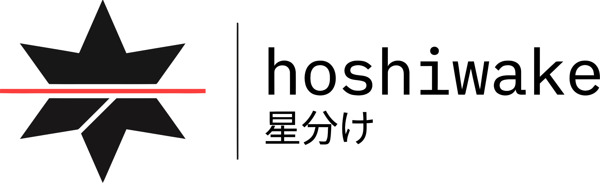

# hoshiwake 星分け




[](https://github.com/adenaufal/hoshiwake/actions/workflows/ci.yml)

A local CLI tool that classifies anime images as SFW, NSFW, or UNCERTAIN and sorts them into folders automatically. Powered by [prithivMLmods/siglip2-x256-explicit-content](https://huggingface.co/prithivMLmods/siglip2-x256-explicit-content) (SiglipForImageClassification). No cloud, no GPU required, and no images leave your machine. The name comes from 星分け, Japanese for "sorting stars".

## Features

- Classifies anime images into SFW / NSFW / UNCERTAIN using a HuggingFace vision model
- Copies or moves files into organized subfolders with configurable confidence thresholds
- Handles JPG, PNG, WEBP, and GIF (first frame) with graceful corrupt-file skipping
- Dry-run mode to preview sorting decisions without copying or moving any files (the output folder and CSV report are still created)
- Generates a CSV report with per-label scores alongside a console summary
- Keeps going when a single image fails: unreadable files, classification errors, and copy failures are recorded per file instead of ending the run
- Always writes a report, even when the run is interrupted with Ctrl+C or aborts unexpectedly
- Works with any image classifier whose labels describe safe/explicit content, not just the default model
- Runs on CPU by default, with optional CUDA/MPS acceleration

## Quick Start

```bash
# Clone and install
git clone https://github.com/adenaufal/hoshiwake.git
cd hoshiwake
pip install -r requirements.txt

# Sort a folder (dry run first; the default model is downloaded
# automatically from Hugging Face on first run)
python main.py --input ./my-images --output ./sorted --dry-run

# Sort for real (copy mode)
python main.py --input ./my-images --output ./sorted --mode copy
```

## Output Structure

```text
sorted/
|- SFW/
|  |- image_001.png
|  `- image_042.jpg
|- NSFW/
|  |- image_007.png
|  `- image_019.webp
|- UNCERTAIN/
|  `- image_033.jpg
`- sort_report.csv
```

## CLI Flags

| Flag | Type | Default | Description |
|------|------|---------|-------------|
| `--input` | path | required | Source folder containing images |
| `--output` | path | required | Destination folder for sorted results |
| `--model` | path or HF id | `models/siglip2-explicit` if present, else `prithivMLmods/siglip2-x256-explicit-content` | Model source for classification |
| `--mode` | `copy` \| `move` | `copy` | Copy or move source files |
| `--threshold` | float | `0.65` | Minimum aggregated category score for hard SFW/NSFW |
| `--margin` | float | `0.10` | Minimum SFW-vs-NSFW score gap for hard SFW/NSFW |
| `--batch-size` | int | `8` | Images per inference batch |
| `--device` | `cpu` \| `cuda` \| `mps` | `cpu` | Inference device |
| `--dry-run` | flag | off | Preview results without copying/moving files (output folder and CSV report are still created) |

## Decision Logic

Every label the model emits is placed into exactly one bucket, then the two bucket totals decide the category.

**Step 1 — bucket each label.** The first rule that matches wins, and NSFW is always tested before SFW so that `nsfw` is never read as `sfw`, `unsafe` never as `safe`, and `not_safe_for_work` never as `safe_for_work`:

| Order | Rule | Bucket |
|-------|------|--------|
| 1 | Exact name `Hentai`, `Pornography`, `label_1` | NSFW |
| 2 | Exact name `Anime Picture`, `Normal`, `label_0` | SFW |
| 3 | Name contains `nsfw`, `unsafe`, `not safe` (any of `_`/`-`/space/no separator), `hentai`, `porn`, `adult`, `explicit`, `prohibit` | NSFW |
| 4 | Name contains `sfw`, `safe`, `allow`, `normal`, `anime`, `neutral`, `drawing`, `general`, `sensitive` | SFW |
| 5 | Anything else (e.g. `Enticing or Sensual`, `sexy`, `questionable`) | neither — counts toward no score |

Matching is case-insensitive. Labels in bucket 5 pull both totals down, which is what pushes borderline content into `UNCERTAIN`.

**Step 2 — apply the gates.** With `sfw_score` and `nsfw_score` as the bucket totals:

- `NSFW` when `nsfw_score >= --threshold` **and** `nsfw_score - sfw_score >= --margin`
- `SFW` when `sfw_score >= --threshold` **and** `sfw_score - nsfw_score >= --margin`
- `UNCERTAIN` otherwise

For the default 5-class model this works out to `SFW = Anime Picture + Normal`, `NSFW = Hentai + Pornography`, with `Enticing or Sensual` counting toward neither. Binary label sets (`sfw`/`nsfw`, `safe`/`unsafe`, `allow`/`prohibit`, `LABEL_0`/`LABEL_1`) and the common 5-class `drawings`/`neutral`/`sexy`/`hentai`/`porn` taxonomy are handled by the same rules with no configuration.

If a model exposes no per-label scores at all, the top label alone is bucketed by the same keyword rules and must clear `--threshold` on its own.

## Report Columns

`sort_report.csv` contains one row per discovered image:

| Column | Meaning |
|--------|---------|
| `filename` | Source file name |
| `category` | Final decision: `SFW`, `NSFW`, or `UNCERTAIN` |
| `label` | Top model label |
| `confidence` | Probability of the top label |
| `sfw_score` / `nsfw_score` | Aggregated group scores the decision was made on |
| `all_scores` | JSON object with every label's probability (for offline threshold re-tuning) |
| `destination` | Actual path written (reflects collision renames; empty for dry-run/skipped) |
| `status` | `sorted`, `dry-run`, `skipped` (unreadable file), or `error` (classification/copy failure) |

If a run is interrupted (Ctrl+C) or aborts on an unexpected error, a partial report covering everything processed so far is still written. Because `all_scores` holds the full probability vector, you can re-tune `--threshold` and `--margin` against an existing report offline instead of re-running inference.

## Exit Codes

| Code | Meaning |
|---|---|
| `0` | Run completed (also returned when the input folder has no supported images) |
| `1` | Invalid arguments, model failed to load, or the run aborted early — a partial report is written for aborted runs |
| `130` | Interrupted with Ctrl+C — a partial report is written |

## Re-triaging UNCERTAIN

`UNCERTAIN` is meant to be re-run, not hand-sorted. Point `--input` at the category folder and `--output` at its parent, in move mode, with looser gates or a different model:

```bash
python main.py --input ./sorted/UNCERTAIN --output ./sorted --mode move --threshold 0.55 --margin 0.05
```

Files that stay `UNCERTAIN` are left where they are; the rest are moved up into `sorted/SFW` or `sorted/NSFW`. This only works with `--mode move` — copying a category folder into its own parent would duplicate every file, so that combination is rejected up front.

## Model Selection

Default model:
- `models/siglip2-explicit` when that local folder exists, otherwise `prithivMLmods/siglip2-x256-explicit-content` is downloaded automatically from Hugging Face

Alternative models to try:
- `models/electrohead-vit-fetish-nsfw-detector` (transformers ViT, binary SFW/NSFW)
- `models/caveduck-nsfw-classifier` (timm ConvNeXt checkpoint, binary SFW/NSFW) — the upstream `CaveduckAI/nsfw-classifier` repo has been removed from Hugging Face, so this backend only works with a previously downloaded local copy

Note:
- For the Caveduck checkpoint, this CLI loads `pytorch_model.pt` with a `timm` ConvNeXt backend. Checkpoints are loaded with `weights_only=True` for safety; if a trusted legacy checkpoint fails to load in safe mode, set `HOSHIWAKE_TRUST_CHECKPOINT=1`.
- For Caveduck outputs, `prohibit` is treated as NSFW and `allow` as SFW.

Download models:

```bash
python -c "from huggingface_hub import snapshot_download; snapshot_download(repo_id='electrohead/vit-fetish-nsfw-detector', local_dir='models/electrohead-vit-fetish-nsfw-detector', allow_patterns=['config.json','model.safetensors','preprocessor_config.json'])"
```

Run with a specific model:

```bash
python main.py --input "L:\path\to\images" --output "L:\path\to\sorted" --device cuda --batch-size 64 --threshold 0.80 --margin 0.12 --mode copy --model "models/electrohead-vit-fetish-nsfw-detector"
```

## Benchmark (CUDA, 12GB VRAM)

Real-world run from user dataset (`2697` images) with:

```bash
python main.py --input "L:\Backup Sementara\NovelAI\want_to_sort" --output "L:\Backup Sementara\NovelAI\sorted" --device cuda --batch-size 64 --threshold 0.80 --mode copy
```

Performance:

| Metric | Value |
|---|---|
| Total images | `2697` |
| Time | `01:47` |
| Throughput | `25.16 img/s` |
| Skipped | `0` |

Output distribution:

| Category | Count | Share |
|---|---:|---:|
| `SFW` | `724` | `26.8%` |
| `NSFW` | `1102` | `40.9%` |
| `UNCERTAIN` | `871` | `32.3%` |

Manual audit findings:

| Finding | Count | Rate |
|---|---:|---:|
| False NSFW (actually questionable or SFW) | `328 / 1102` | `29.8%` |
| False SFW (actually questionable or NSFW) | `31 / 724` | `4.3%` |
| NSFW inside `UNCERTAIN` | `187 / 871` | `21.5%` |

These findings suggest the current threshold is conservative for SFW/NSFW separation and still leaves meaningful NSFW content in `UNCERTAIN`, so manual review of `UNCERTAIN` remains important.

This run used the default 5-class model, whose labels all match by exact name — the bucketing rules above produce the same numbers for it. Results collected with binary or alternate-taxonomy models before those rules were fixed are not comparable and should be re-measured.

## Development

Dependencies and checks are described in [CONTRIBUTING.md](CONTRIBUTING.md). The decision logic, file sorting, and reporting have unit tests that need neither a model nor a GPU:

```bash
python -m unittest discover -s tests
```

CI runs these on Python 3.10 and 3.12 with a CPU-only build of torch.

## Troubleshooting

| Symptom | Cause and fix |
|---|---|
| Everything lands in `UNCERTAIN` | The model's labels may fall outside the keyword rules above. Check the `all_scores` column in the report — if `sfw_score` and `nsfw_score` are both near zero, the labels are not being bucketed. Lower `--threshold`/`--margin` first, then extend `NSFW_KEYWORDS`/`SFW_KEYWORDS` in `sorter.py` if needed. |
| The model downloads even though a local copy exists | The local folder is only used when it sits at `models/siglip2-explicit` next to `main.py`. Pass `--model /absolute/path` to be explicit; the model source is printed at startup. |
| Rows with `status=error` | The file was readable but classification or the copy/move failed. The reason was printed as a `[WARN]` line during the run; the file is left in place. |
| Rows with `status=skipped` | The file could not be opened as an image (corrupt, truncated, or a decompression-bomb guard trip). |
| A trusted local `.pt` checkpoint fails to load | Checkpoints load with `weights_only=True`. Re-run with `HOSHIWAKE_TRUST_CHECKPOINT=1` only if you trust the file's origin. |
| Filenames gained a `_1` suffix | A file with that name already existed in the destination category; the original is never overwritten. The path actually written is in the `destination` column. |

## Roadmap

- [x] Per-label scores in the report for offline threshold tuning
- [ ] Asymmetric gates: separate `--sfw-threshold` and `--nsfw-threshold`
- [ ] Recursive subfolder scanning with `--recursive` flag
- [ ] YAML/TOML config file support for persistent settings
- [ ] Web UI for visual review of UNCERTAIN results before final sort
- [ ] Ensemble classification across two models
- [ ] Undo log to reverse a sort operation

## License

MIT
